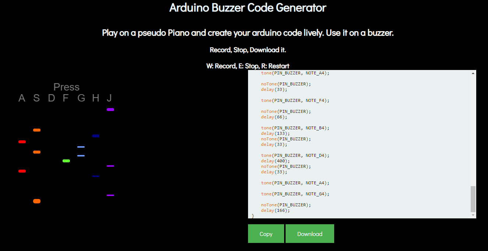

# Arduino Buzzer Code Generator

A p5.js project that allows you to play on a pseudo piano and create your arduino code lively to use on a buzzer/speaker.

## How to use it

Open the [live preview](https://ThiagoAugustoSM.github.io/arduino-buzzer-code-generator/)

- Press the 'W' button to start recording.
- Play the piano, create your buzzer file.
- Press 'E' to stop recording then click in the 'download' or 'copy' button.

## Uploading to Arduino

Download the buzzer.ino file and you will be able to upload it to your arduino using the Arduino IDE or others.

